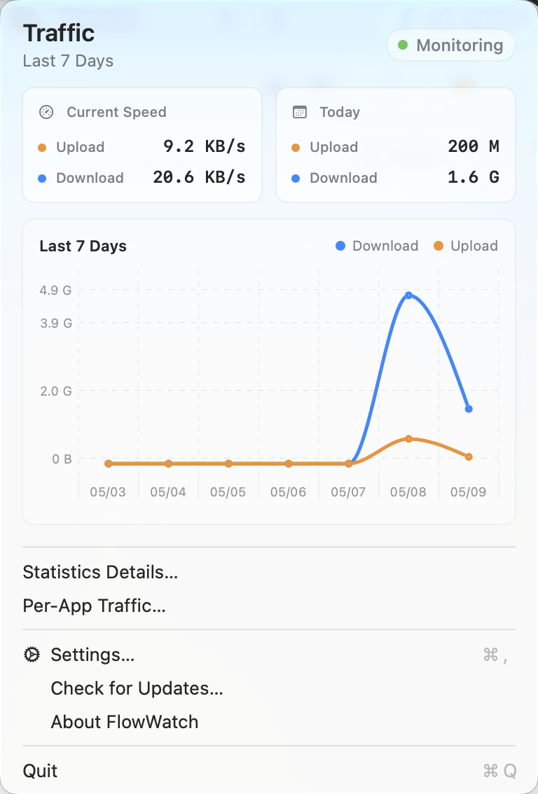
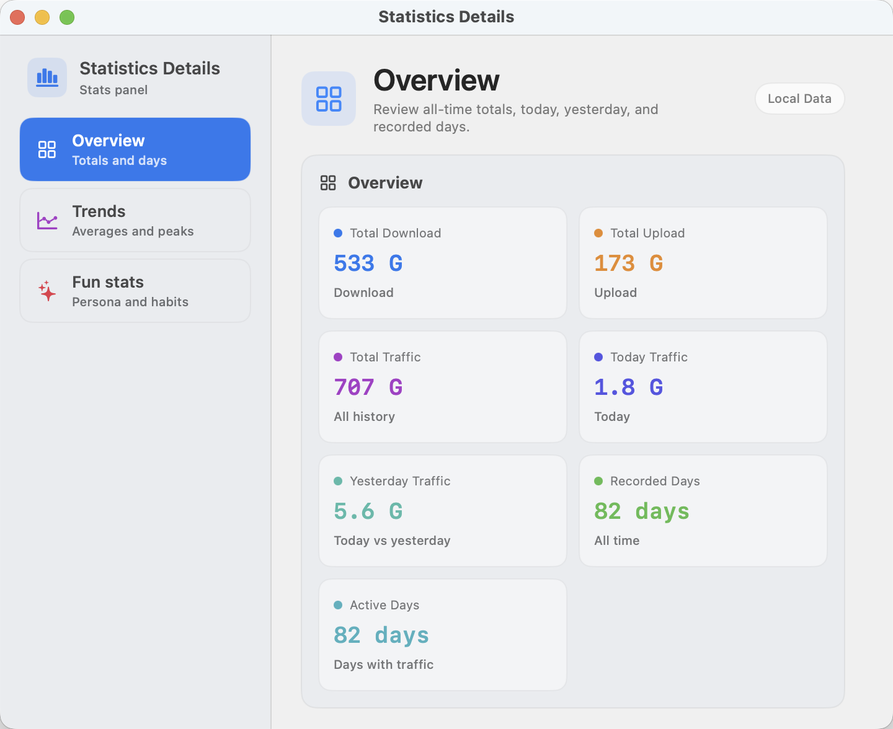
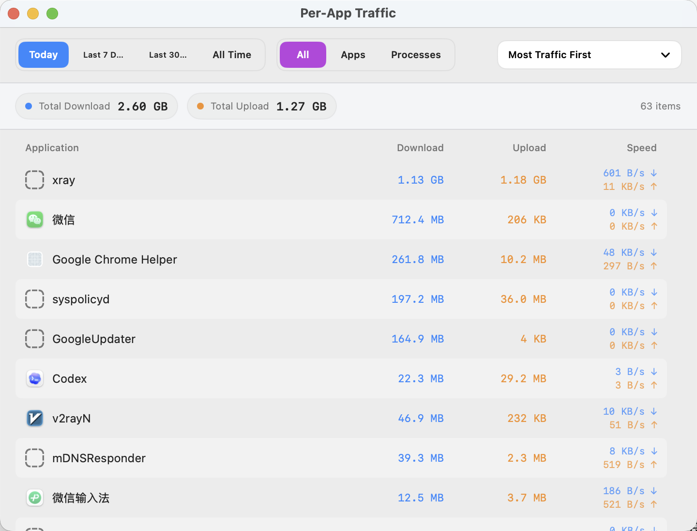
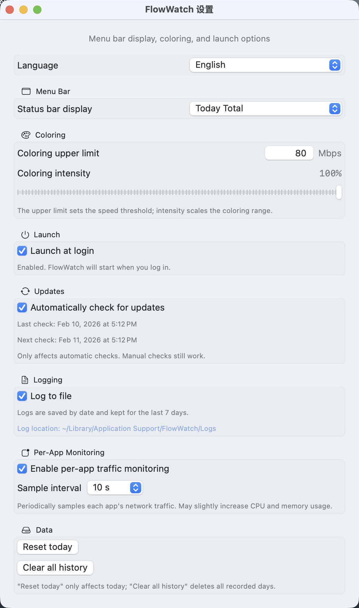

<div align="center">
  
  <h1>FlowWatch</h1>
  <p>Lightweight macOS menu bar network monitor: live speed, traffic stats, and trends.</p>
</div>

[简体中文](README.md) | English

> 🖥 Windows version: [FlowWatch-Win](https://github.com/W1tFzQq08pTv/FlowWatch-Win)

## Features
- Real-time upload/download speed in the menu bar
- Menu popup with current speed, today's total, and a 7-day trend chart (Charts, macOS 13+)
- Dedicated statistics details window with overview, trends, and fun stats sections
- Per-app traffic monitoring with date range filters and sorting
- Custom sampling interval and display style
- Automatic checks and background downloads from GitHub Releases, always asking before install or relaunch, with reminders, install-on-quit, and ordinary-version skipping
- Optional file logging (daily logs, kept for 7 days)

## Data & Privacy
- Traffic stats are calculated locally from system network interface counters; no packet content is captured.
- Settings and daily totals are stored on your device only (UserDefaults).
- Logs (if enabled) are written locally and never uploaded or synced.
- No account is required, and the app does not upload or sync your data.

## Statistics Details
The statistics details window keeps the main popup focused while providing a fuller view of historical traffic.

- Overview: total download, total upload, total traffic, recorded days, and active days
- Trends: 7-day total, 7-day daily average, historical daily average, today vs yesterday, and peak day
- Fun stats: traffic title, upload/download ratio, download share, most active date, and latest active day

## Install
### Homebrew
```bash
brew tap w1tfzqq08ptv/flowwatch
brew install --cask flowwatch
```

After installation through Homebrew Cask, subsequent versions are still delivered by FlowWatch's built-in updater from GitHub Releases; the app does not run or copy `brew upgrade` commands.

For an important update, create an annotated tag whose tag message is exactly `sparkle:critical`. The release workflow adds critical-update metadata to the appcast; clients cannot skip that version, but may still install it later.

### Download from Releases
Download the latest DMG from GitHub Releases:
[FlowWatch Releases](https://github.com/W1tFzQq08pTv/FlowWatch/releases)

## Screenshots
| Status bar: speed | Status bar: today | Status bar: speed + today |
| --- | --- | --- |
|  |  |  |

| Menu Popup | Statistics Details |
| --- | --- |
|  |  |

| Per-App Traffic | Settings |
| --- | --- |
|  |  |
