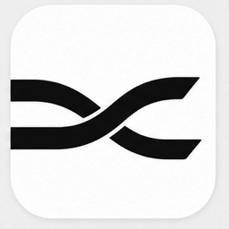
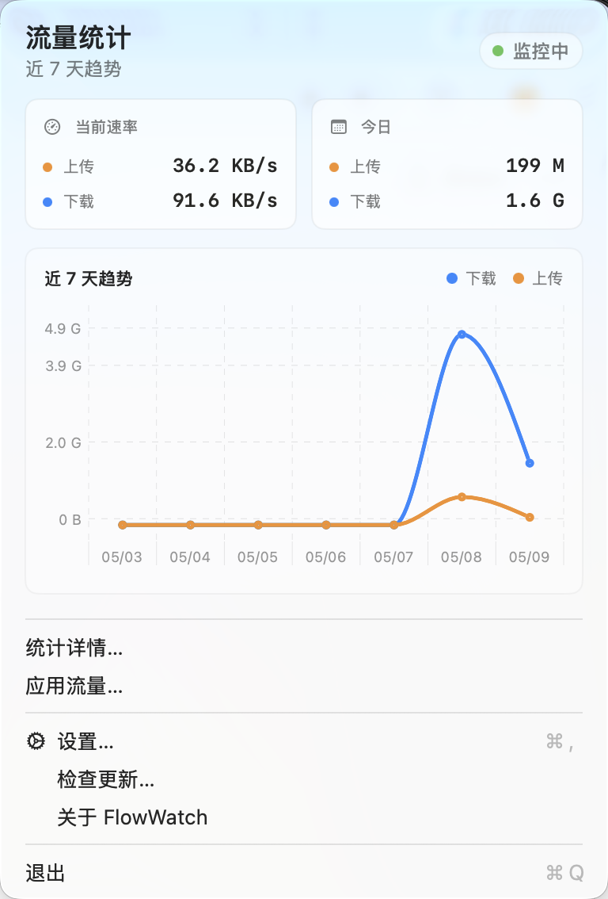
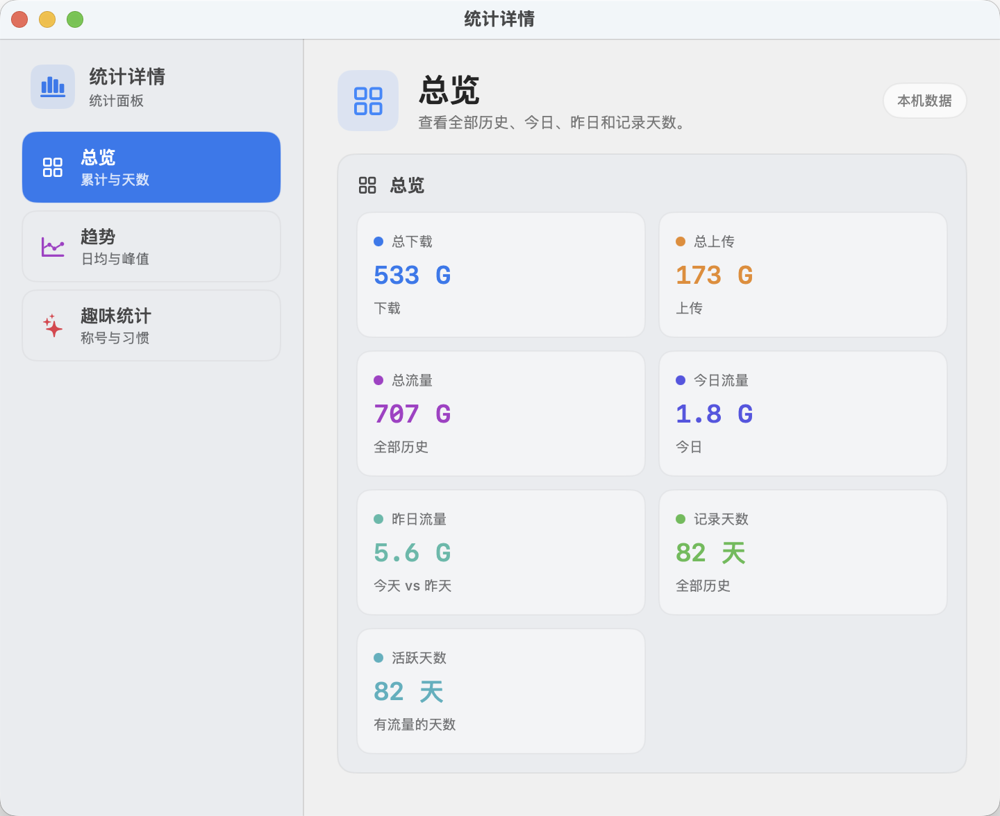
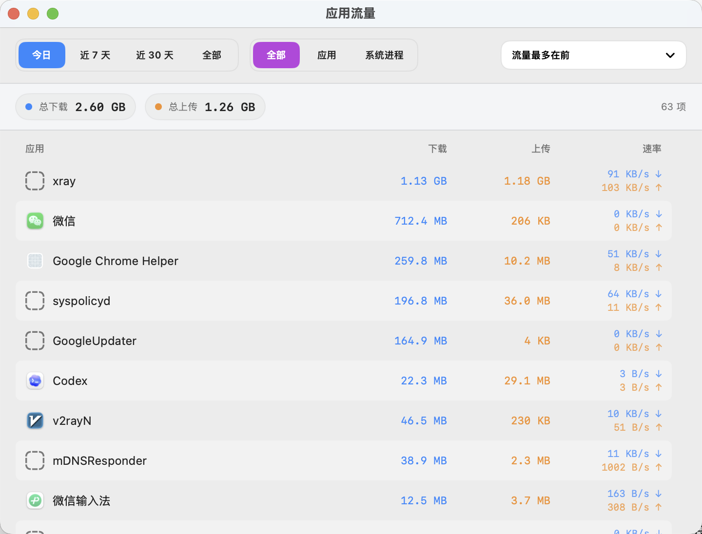
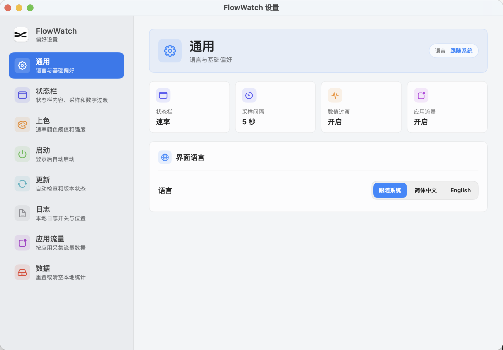

<div align="center">
  
  <h1>FlowWatch</h1>
  <p>轻量级 macOS 菜单栏网速监控工具：实时速率、流量统计与趋势图。</p>
</div>

简体中文 | [English](README.en.md)

> 🖥 Windows 版本：[FlowWatch-Win](https://github.com/huangxida/FlowWatch-Win)

## 功能
- 菜单栏实时显示上行/下行速率
- 下拉主面板展示当前速率、今日累计与近 7 天趋势图（Charts，macOS 13+）
- 独立统计详情窗口：总览、趋势、趣味统计分区展示
- 应用流量监控：按应用统计网络流量，支持日期范围筛选与排序
- 自定义采样间隔与显示样式
- 自动检查更新并显示上次/下次检查时间
- 可选日志输出（按天保存，保留 7 天）

## 数据与隐私
- 流量统计仅在本地基于系统网卡计数器计算，不采集任何包内容。
- 设置项与每日流量仅保存在本机（UserDefaults）。
- 日志（如开启）仅写入本地文件，不会上传或同步。
- 无需账号，应用不会上传或同步你的数据。

## 统计详情
统计详情窗口用于承接主面板之外的更多历史数据分析，保持主面板简洁的同时，提供更完整的流量回顾。

- 总览：总下载、总上传、总流量、记录天数、活跃天数
- 趋势：近 7 天总量、近 7 天日均、历史日均、今日较昨日、峰值日期
- 趣味统计：流量称号、上传/下载系数、下载占比、最活跃日期、最近活跃日

## 安装
### Homebrew
```bash
brew tap huangxida/flowwatch
brew install --cask flowwatch
```

### 从发布页下载
前往 GitHub Releases 下载最新的 DMG：
[FlowWatch Releases](https://github.com/huangxida/FlowWatch/releases)


## 截图
| 状态栏：速率 | 状态栏：今日统计 | 状态栏：速率 + 今日统计 |
| --- | --- | --- |
|  |  |  |

| 主面板 | 统计详情 |
| --- | --- |
|  |  |

| 应用流量 | 设置 |
| --- | --- |
|  |  |
